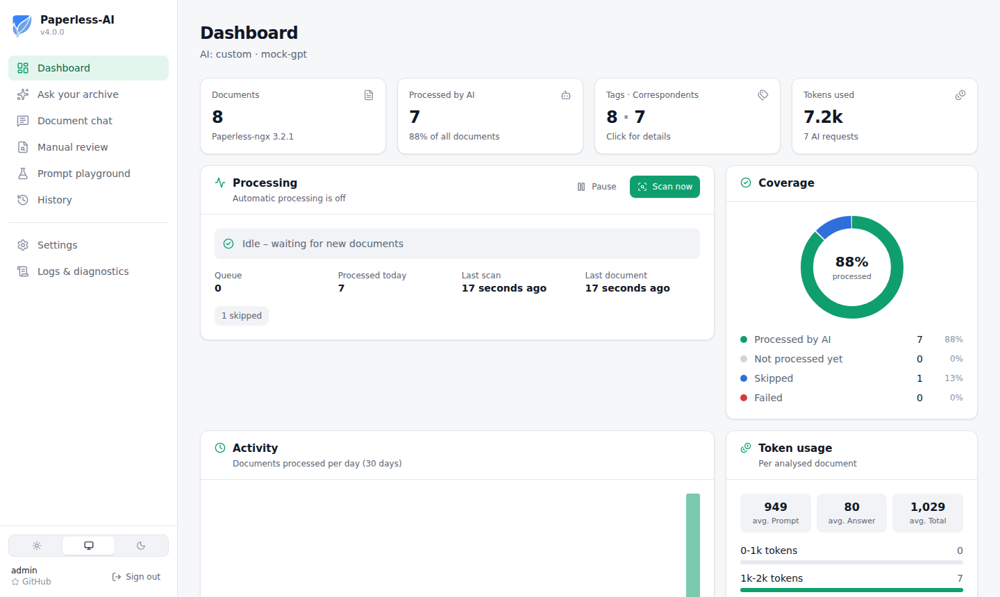
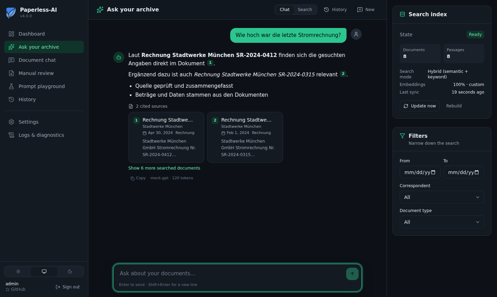
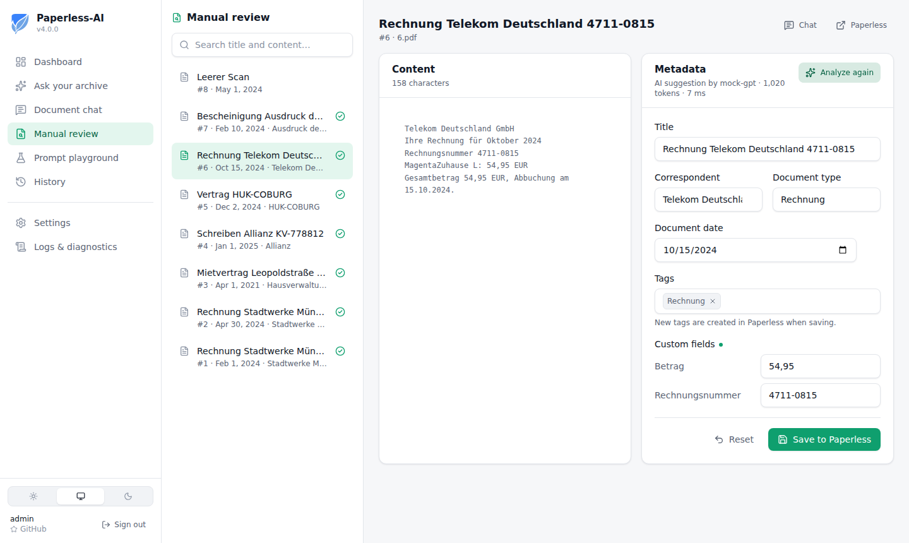
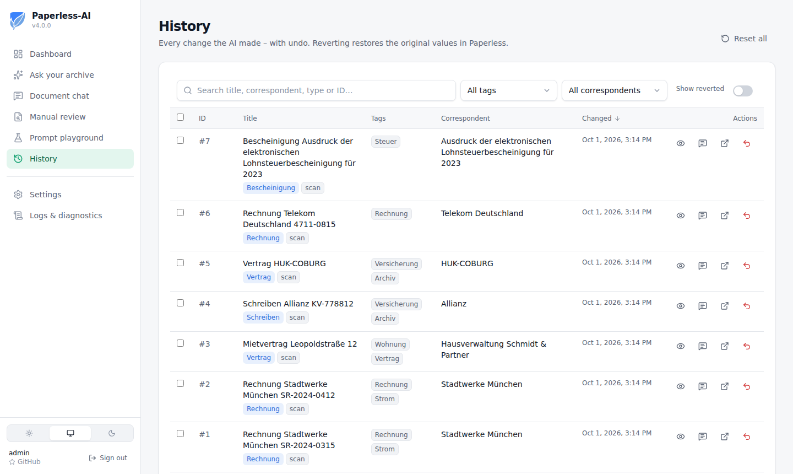

# 📄 Paperless-AI

[](https://github.com/clusterzx/paperless-ai/commits/main)
[](https://hub.docker.com/r/clusterzx/paperless-ai)
[](https://github.com/clusterzx)
[](LICENSE)

**Paperless-AI** is an AI extension for [Paperless-ngx](https://github.com/paperless-ngx/paperless-ngx). It analyzes your documents and fills in title, tags, correspondent, document type, date and custom fields – and lets you **ask questions about your whole archive** in natural language, with answers that cite their sources.

Works with **Paperless-ngx 2.x and 3.x**, OpenAI, **Ollama (fully local)**, Azure OpenAI and every OpenAI-compatible API (DeepSeek, OpenRouter, LiteLLM, vLLM, LM Studio, Gemini, Together, Perplexity, …).

> 💡 Just ask:
> “When did I sign my rental agreement?”
> “What was the amount of the last electricity bill?”
> “Which documents mention my health insurance?”



---

## ✨ What's new in 4.0 – a complete rewrite

Version 4 is rebuilt from scratch with a focus on reliability, speed and low resource usage.

| | 3.x | 4.0 |
| --- | --- | --- |
| Architecture | Node.js + separate Python service (Torch, ChromaDB, NLTK) | One Node.js process (TypeScript) |
| Docker image | several GB | **~135 MB** compressed |
| RAM in idle | 1–2 GB | **≈ 80–150 MB** (embedding model loaded on demand) |
| RAG retrieval | one embedding of the first ~100 words per document | **chunked passages**, hybrid **BM25 + vector** search, metadata boosts |
| RAG answers | not streamed, no references | **streamed**, **cited sources** `[1]`, follow-up questions |
| Index updates | full re-crawl & re-embed | **incremental** (changed/deleted documents only) |
| Settings | written to `.env`, container restart required | validated, **applied instantly** – no restart |
| Paperless-ngx | 2.x | **2.x and 3.x** (API version negotiated automatically) |
| Undo | only “forget processing state” | **real undo** – restores the original values in Paperless |

Upgrading from 3.x is automatic: your `data/.env`, user account, processing state, history and token statistics are migrated on first start (the old files are kept untouched).

## 🚀 Features

**Automatic processing**
- Detects new documents (schedule and/or instantly via a Paperless **workflow webhook**)
- Title, tags, correspondent, document type, document date and **custom fields** (text, number, monetary, date, boolean, URL)
- Structured JSON output (JSON schema) with automatic fallback for providers without support
- Process all documents or only documents with **trigger tags** (optionally removed afterwards), mark processed documents with a tag
- Restrict the AI to existing tags / correspondents / document types, or to a fixed tag list
- Optional context from an **external API** (e.g. your customer list) with a sandboxed transformation
- Parallel processing, retries with back-off, failed/skipped documents visible on the dashboard

**Ask your archive (RAG)**
- Hybrid search: SQLite FTS5 (BM25) + compact in-memory vector index (int8)
- Embeddings: built-in multilingual model (offline, CPU), Ollama, OpenAI, Azure, any OpenAI-compatible API – or keyword-only
- Understands follow-up questions, filters (date range, correspondent, document type), “latest …” questions and mentioned years/correspondents
- Answers stream in, cite their sources and link to the documents in Paperless; conversations are kept in your browser
- Pure semantic **search mode** without AI costs



**Interactive tools**
- **Document chat** – ask questions about a single document (long documents are handled automatically)
- **Manual review** – let the AI suggest metadata and decide yourself what to save
- **Prompt playground** – test prompts on real documents side by side with the current values, rate and keep prompts
- **History with undo**, filters and search
- **Dashboard** with live processing status, coverage, activity, token usage
- **Logs & diagnostics** – live log stream, connection checks, Paperless API explorer
- Light/dark theme, works on mobile

| Manual review | History with undo |
| --- | --- |
|  |  |

## 🐳 Installation

```yaml
# docker-compose.yml
services:
  paperless-ai:
    image: clusterzx/paperless-ai:latest
    container_name: paperless-ai
    restart: unless-stopped
    ports:
      - "3000:3000"
    volumes:
      - paperless-ai_data:/app/data
    extra_hosts:
      - "host.docker.internal:host-gateway" # to reach Ollama on the Docker host

volumes:
  paperless-ai_data:
```

```bash
docker compose up -d
```

Open `http://<your-server>:3000` – the setup wizard guides you through account, Paperless connection, AI provider and processing options. No restart is needed afterwards.

**Paperless API user:** create a dedicated user in Paperless-ngx with permission to *view* and *change* documents, tags, correspondents, document types and custom fields, and use its API token (Profile → API Auth Token). Only documents this user may change are processed.

### Instant processing with a Paperless workflow

1. Paperless-ngx → *Workflows* → *Add workflow*, trigger **Document Added**
2. Action **Webhook**: URL `http://paperless-ai:3000/api/webhook/document`, body parameter `url` = `{doc_url}`
3. Header `x-api-key: <API key from Settings → API & webhooks>`

## ⚙️ Configuration

Everything can be configured in the web interface. Settings are stored in `data/config.json`.
Environment variables **override** stored settings (the UI shows them as locked) – handy for Docker deployments. The variable names of 3.x are still supported.

| Variable | Setting |
| --- | --- |
| `PAPERLESS_AI_PORT` | HTTP port (default `3000`) |
| `PAPERLESS_AI_DATA_DIR` | data directory (default `./data`, `/app/data` in Docker) |
| `PAPERLESS_API_URL`, `PAPERLESS_API_TOKEN` | Paperless-ngx URL (with or without `/api`) and token |
| `PAPERLESS_PUBLIC_URL` | URL for links opened in the browser (optional) |
| `AI_PROVIDER` | `openai`, `ollama`, `custom`, `azure` |
| `OPENAI_API_KEY`, `OPENAI_MODEL` | OpenAI |
| `OLLAMA_API_URL`, `OLLAMA_MODEL`, `OLLAMA_KEEP_ALIVE` | Ollama |
| `CUSTOM_BASE_URL`, `CUSTOM_API_KEY`, `CUSTOM_MODEL` | OpenAI-compatible provider |
| `AZURE_ENDPOINT`, `AZURE_API_KEY`, `AZURE_DEPLOYMENT_NAME`, `AZURE_API_VERSION` | Azure OpenAI |
| `TOKEN_LIMIT`, `RESPONSE_TOKENS`, `AI_TEMPERATURE`, `AI_TIMEOUT_SECONDS` | model limits |
| `SCAN_INTERVAL`, `DISABLE_AUTOMATIC_PROCESSING`, `PROCESSING_CONCURRENCY` | scheduling |
| `PROCESS_PREDEFINED_DOCUMENTS`, `TAGS`, `REMOVE_TRIGGER_TAGS` | only process tagged documents |
| `ADD_AI_PROCESSED_TAG`, `AI_PROCESSED_TAG_NAME` | mark processed documents |
| `USE_PROMPT_TAGS`, `PROMPT_TAGS`, `USE_EXISTING_DATA`, `SYSTEM_PROMPT` | prompt |
| `ACTIVATE_TAGGING`, `ACTIVATE_CORRESPONDENTS`, `ACTIVATE_DOCUMENT_TYPE`, `ACTIVATE_TITLE`, `ACTIVATE_CUSTOM_FIELDS`, `ACTIVATE_DOCUMENT_DATE` | enabled functions |
| `RESTRICT_TO_EXISTING_TAGS`, `RESTRICT_TO_EXISTING_CORRESPONDENTS`, `RESTRICT_TO_EXISTING_DOCUMENT_TYPES` | restrictions |
| `CUSTOM_FIELDS` | custom fields (JSON, format of 3.x) |
| `EXTERNAL_API_ENABLED`, `EXTERNAL_API_URL`, `EXTERNAL_API_METHOD`, `EXTERNAL_API_HEADERS`, `EXTERNAL_API_BODY`, `EXTERNAL_API_TIMEOUT`, `EXTERNAL_API_TRANSFORM` | external data |
| `RAG_ENABLED` (or `RAG_SERVICE_ENABLED`), `RAG_EMBEDDING_PROVIDER`, `RAG_EMBEDDING_MODEL` | ask your archive |
| `API_KEY`, `JWT_SECRET` | secrets (generated automatically when unset) |
| `LOG_LEVEL`, `LOG_FORMAT=json`, `TRUST_PROXY=false` | operations |

Self-signed certificates for Paperless/AI endpoints: mount your CA and set `NODE_EXTRA_CA_CERTS=/path/ca.pem`.

### Choosing embeddings for “Ask your archive”

| Option | Notes |
| --- | --- |
| **Local** (default) | `Xenova/multilingual-e5-small` (~120 MB, downloaded once to `data/models`), 100+ languages, runs on the CPU in a worker thread and is unloaded when idle |
| Ollama | e.g. `nomic-embed-text`, `bge-m3`, `mxbai-embed-large` (`ollama pull …`) |
| OpenAI / OpenAI-compatible / Azure | e.g. `text-embedding-3-small` |
| None | keyword search only (BM25) – smallest footprint |

Changing the embedding model re-embeds the passages automatically; the keyword search keeps working meanwhile.

## 🔌 API

The REST API is documented at `/api-docs` (OpenAPI). Authenticate with the header `x-api-key`. The endpoints used by the Paperless-AI browser extension and by scripts written for 3.x (`/chat/init/:id`, `/chat/message`, `/api/scan/now`, `/api/webhook/document`, `/api/rag/ask`, …) are still available.

## 🧑‍💻 Development

Requirements: Node.js ≥ 22.12.

```bash
npm install
npm run dev          # backend (tsx watch, port 3000) + web UI (Vite, port 5173)
npm run demo         # demo with a fake Paperless-ngx and a fake LLM: http://127.0.0.1:3456 (admin / demo1234)
npm run check        # typecheck + lint + unit/integration tests
npm run test:e2e     # Playwright end-to-end tests (uses the demo server)
npm run build && npm start
```

Architecture overview: [docs/ARCHITECTURE.md](docs/ARCHITECTURE.md).

## 🤝 Contributing

Pull requests are welcome! Please run `npm run check` before submitting.

## 🆘 Support & Community

- [Issues](https://github.com/clusterzx/paperless-ai/issues)
- [Discord](https://discord.gg/AvNekAfK38)

## 📄 License

MIT – see [LICENSE](LICENSE).

## 🙏 Support Development

[](https://www.patreon.com/c/clusterzx)
[](https://www.paypal.com/paypalme/bech0r)
[](https://www.buymeacoffee.com/clusterzx)
[](https://ko-fi.com/clusterzx)
